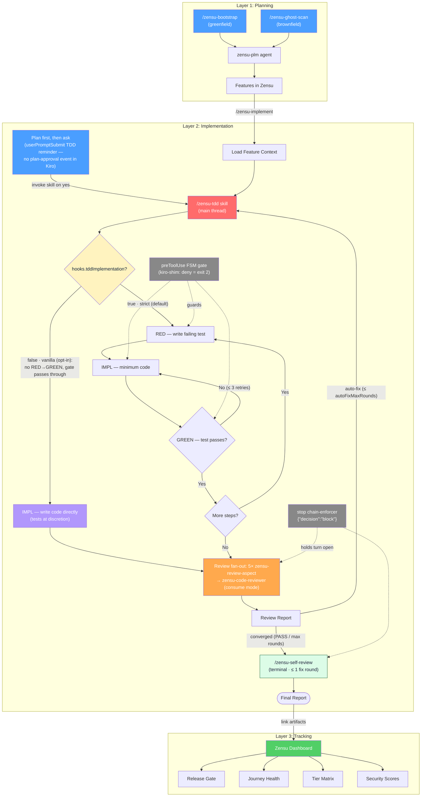

# zensu-kiro


The **Kiro port of [Zensu](https://zensu.dev)** — a Product Lifecycle Manager
that makes **features first-class citizens** from roadmap to release: feature
tracking with `KEY-N` feature ids, strict RED→GREEN TDD behind a phase-gated edit
guard, a five-perspective review chain, security reviews with STRIDE threat
models, greenfield bootstrap and brownfield ghost-scan. The plugin drives Zensu
through the typed [`zensu` CLI](https://zensu.dev) (≥ 0.2.0); the hosted MCP
server stays live for the Zensu web app's own assistant but is no longer wired
into the plugin.

One repo serves **both Kiro hosts**: the IDE installs it as a **Power**
(`POWER.md` at the repo root), the CLI — which has no native plugin system —
installs via `install.sh`. Both converge on the shared `~/.kiro/` surfaces
(skills, agents, steering), so each host sees the same plugin.

## Requirements

- **Zensu CLI ≥ 0.2.0** (`zensu --version`) on `PATH` — the plugin drives Zensu
  through it. Install: `curl -fsSL https://zensu.dev/install.sh | sh`, then
  `zensu auth login` (see [Authentication](#authentication)).
- **Kiro CLI ≥ 2.6** (`kiro-cli`) and/or **Kiro IDE ≥ 0.9**
- `node` (all JSON handling), `bash`, `git`
- Windows: Kiro CLI is native, the zensu hooks need **Git Bash** (see below)

## Install

### Kiro CLI

```bash
# 1. Install the Zensu CLI (the plugin drives Zensu through it) and sign in
curl -fsSL https://zensu.dev/install.sh | sh
zensu auth login                      # browser OAuth2 + PKCE (see Authentication)

# 2. Install the plugin into the shared ~/.kiro/ surfaces
git clone https://github.com/MKITConsulting/zensu-kiro
cd zensu-kiro
bash install.sh                       # --scope user (default)

# 3. (optional) make the gate-enforced agent the default for every session
kiro-cli agent set-default zensu
kiro-cli chat --agent zensu
```

`install.sh` flags: `--scope user|workspace` · `--dry-run` · `--force` ·
`--set-default|--no-default` · `--uninstall`. It is idempotent (manifest with
per-file sha256), never stomps user-modified files (SKIP + warn), and uninstalls
only what it installed. Zensu data access goes through the `zensu` CLI you
installed in step 1 — the hosted MCP server is no longer wired into the plugin.

### Kiro IDE (Power)

Powers panel → **Add power from GitHub** (this repo URL) or **from Local
Path**, then follow the onboarding in [POWER.md](POWER.md) (one `install.sh` run
adds skills + subagents shared with the CLI). Install the `zensu` CLI and run
`zensu auth login` the same way as for the CLI host above.

### Headless / CI

```bash
ZENSU_API_KEY=zsk_... kiro-cli chat --no-interactive --agent zensu --trust-all-tools "<prompt>"
```

In headless environments authenticate the `zensu` CLI with an API key instead of
the browser flow — see [Authentication](#authentication).

## Authentication

The plugin drives Zensu through the typed `zensu` CLI, which talks to the Zensu
backend (default `https://api.zensu.dev`). Authenticate the CLI once:

- **OAuth (default, interactive):** sign in through the browser (OAuth2 + PKCE):
  ```bash
  zensu auth login
  zensu auth status     # verify; `zensu auth logout` clears credentials
  ```
- **API key (CI / headless):** log in with a key instead of the browser:
  ```bash
  zensu auth login --with-token zsk_...      # or:  echo "$ZENSU_API_KEY" | zensu auth login --with-token -
  ```
- **Self-hosting:** point the CLI at your own endpoint, by flag or environment.
  Resolution order: `--api-url` flag → `ZENSU_API_URL` → stored host → `https://api.zensu.dev`.
  ```bash
  zensu auth login --api-url https://api.example.internal
  # or, per-invocation:
  export ZENSU_API_URL=https://api.example.internal
  ```

> **MCP note.** The hosted MCP server at `https://mcp.zensu.dev/mcp` is **no
> longer wired into the plugin** — it stays live for the Zensu web app's own AI
> assistant. Earlier `zensu-kiro` releases registered it via
> `~/.kiro/settings/mcp.json`; that wiring has been removed (see
> [CHANGELOG](CHANGELOG.md)).

> **Graceful degradation:** the TDD engine, code review, and progress logging
> work with **no Zensu account / no CLI sign-in**. The `zensu` CLI only augments
> the flow (auto-link tests/sources, status updates, revisions, release gating).

## What you get

| Piece | Names |
|---|---|
| **CLI** | `zensu <noun> <verb>` — feature CRUD, security, tiers, journeys, revisions, bootstrap, ghost-scan, pulse, docs (`zensu --help`). Install: `curl -fsSL https://zensu.dev/install.sh \| sh`; auth: `zensu auth login`. The hosted MCP server (`mcp.zensu.dev`) stays live for the Zensu web app's own assistant, but is no longer wired into the plugin |
| **Skills** (slash commands, IDE + CLI) | `/zensu-bootstrap` · `/zensu-ghost-scan` · `/zensu-implement` · `/zensu-tdd` · `/zensu-plan-review` · `/zensu-pr-team-review` · `/zensu-security-review` · `/zensu-self-review` · `/zensu-reset-review-limit` · `/zensu-pulse` · `/zensu-help` |
| **Agents** | `zensu` (default orchestrator, carries all hooks) · `zensu-plm` (PLM workflows, CLI-gate-exempt by design) · `zensu-code-reviewer` · `zensu-review-aspect` (read-only reviewers) |
| **Hooks** (inside `zensu` agent config) | TDD phase-gate (`preToolUse` write) · CLI write-gate (`preToolUse` `shell`/`execute_bash`) · shell witness (`postToolUse shell`) · review delegate (`postToolUse subagent`) · stop chain-enforcer (`stop`) · intent router + TDD reminder + context nudge (`userPromptSubmit`) · banner/primer/pulse/sid (`agentSpawn`) |

### The zensu CLI

A GitHub-CLI-style binary (`zensu <noun> <verb>`) covering the full surface —
feature CRUD, subfeatures, linking, security, revisions, lifecycle, tiers,
journeys, bootstrap, product studio, docs context, wiki, knowledge search, pulse,
and ghost-scan. The skills and the `zensu-plm` agent invoke it by command
(`zensu features create`, `zensu ghost scan`, …); every command takes `--json`
and documents its flags via `zensu <noun> <verb> --help`. Driving the typed CLI
instead of the legacy multi-tool MCP surface reclaims ~22k context tokens per
request.

## The TDD engine

`/zensu-tdd` runs strict RED→IMPL→GREEN in the main thread. While a session is
armed (`zensu-log.sh --tdd-begin`), the **phase-gate** denies `write`-tool edits
that violate the FSM (production code before a failing test → **exit 2**, the
reason goes straight back to the model), the **witness** records every shell
command for the audit cross-check, and the **stop chain-enforcer** refuses to
end the turn (`{"decision":"block"}`) until the five-perspective review chain
and `/zensu-self-review` have completed. See
[steering/zensu-tdd-protocol.md](steering/zensu-tdd-protocol.md) for the
phase-marker cheat sheet. Setting `hooks.tddImplementation=false` switches to
**vanilla mode** — the RED→GREEN ceremony and phase-gate are dropped while the
review chain and evidence audits stay enforced (the vanilla branch below).



## CLI write-gate

The `zensu` CLI is **read-free, write-gated**. Any state-mutating command
(creating or updating features, security classifications, tiers, journeys,
revisions, …) run directly on the main thread is **denied by default** — it must
run inside a skill that declared its work, so "freelance" writes cannot bypass
the dedup, user-journey, baseline-revision and security-review conventions the
skills enforce. Reads, telemetry, and `--help` are always allowed.

The gate is a `preToolUse` hook on the Kiro `shell` / `execute_bash` tool
(`pre-bash-zensu-gate.sh`, wired under both matcher names via `kiro-shim.sh`): it
parses `zensu <noun> <verb>` out of the shell command, resolves each to its
canonical tool name via `hooks/lib/zensu-cli-map.sh`, and classifies it with the
`hooks/lib/zensu-mcp-tools.sh` source of truth. A skill opens a **scoped** window
with `zensu-log.sh --workflow-begin --tools "<exact tool set>"` — the bypass then
allows **only** that skill's declared tools — and `--workflow-end` closes it
again. The `zensu-plm` agent is exempt by design (it carries the workflow
conventions itself). It is a **convention-nudge, not a hard boundary** — once the
CLI's OAuth token is cached on disk an agent could `curl` the backend directly;
the gate enforces the workflow conventions, not a security control (the same
role, and the same `ZENSU_MCP_GATE=off` escape, as the MCP write-gate it
replaced). It never fires on reads, `--help`, or a write whose target backend
(`--api-url` flag / `ZENSU_API_URL` env) is **localhost** — a throwaway dev/test
DB where the conventions are meaningless. A structure test
(`tests/structure/test-skill-workflow-markers.sh`) fails the build if any skill
runs a mutation command without the `--workflow-begin` / `--workflow-end`
markers.

## Claude Code → Kiro fidelity matrix

| Upstream mechanism | Kiro CLI | Kiro IDE |
|---|---|---|
| Plugin packaging (`.claude-plugin/`) | `install.sh` (no native plugin system, [kirodotdev/Kiro#8578](https://github.com/kirodotdev/Kiro/issues/8578)) | **Power** (`POWER.md`) |
| Skills `/zensu:x` | **FULL ✓ live-verified** — Agent Skills standard; `/zensu-x` slash commands interactively, invoke by name in `--no-interactive` (headless parses a leading `/` as a built-in command) | **FULL** (same skill dirs) |
| Subagents | **FULL ✓ live-verified** — `subagent` tool (payloads report `use_subagent`), max 4 concurrent (5-aspect fan-out queues the fifth) | **FULL** — `.kiro/agents/*.md` |
| TDD phase-gate (PreToolUse deny) | **FULL ✓ live-verified (D2)** — exit 2 + stderr via `kiro-shim.sh`; a real premature `write` was blocked, file unchanged | advisory (steering) — pending R8 |
| CLI write-gate | **FULL ✓ live-verified (B3)** — `shell`/`execute_bash` matcher + `pre-bash-zensu-gate.sh` parses `zensu <noun> <verb>`, denied a direct `zensu features create` and redirected | advisory (steering) |
| Stop chain enforcement | **mechanism ✓ live-verified (D3)** — enforcer fires and emits `{"decision":"block"}` (budget written); the re-prompt loop is interactive-session behavior, headless `--no-interactive` runs end regardless | n/a |
| Review auto-fix loop (PostToolUse on agent completion) | **FULL ✓ live-verified (D4/R3)** — fires on `use_subagent` completion; wired under both matcher names | skill prose |
| Plan-approval TDD ask (ExitPlanMode) | **DEGRADED by design** — replaced by the per-turn `userPromptSubmit` TDD reminder (**✓ live-verified, B2**: asks before editing, file untouched) + steering | same |
| Session identity | payloads carry **no `session_id`** (live-verified) — convergence via the project-scoped `.zensu/state/session-id-current.txt` written at `agentSpawn` (pinned by `test-session-resolution.sh`) | same |
| Context-compaction nudge | wired but **inert** (Claude-transcript-shaped payload) | n/a |
| Session banner/primer | **FULL ✓ live-verified** (`agentSpawn`; payload keys `hook_event_name`/`cwd`/`prompt`, fires on every spawn) | n/a |
| Pulse session telemetry | **FULL ✓ live-verified (B6)** (plugin-root + `zensu pulse` CLI commands) | **FULL** |

Verified against kiro-cli **2.6.1** (2026-06-10): diagnostics suite (D1–D4, D6)
5/5, behavior suite B1–B3+B6 green, and the [slow] B5 full-TDD live run green (RED_FAIL→IMPL→GREEN_PASS in the FSM state, 18 witness-recorded shell commands) — `tests/promptfoo/results/`. Re-run
`bash tests/run-promptfoo.sh diagnostics` after Kiro releases to re-verify.

Known kiro-cli 2.6.1 host bug (observed via the B5 live eval): when a
preToolUse hook **blocks** the same tool call repeatedly, the client can crash
with a Bedrock `ValidationException: duplicate toolResult Ids`
(`chat-cli/mod.rs:1905`) and end the session — the gate's deny itself works as
designed; consider reporting upstream if you hit it interactively.

## Configuration

`~/.zensu/config.json` (seeded from [config.example.json](config.example.json),
shared schema with the Claude Code and Codex ports): `hooks.*` toggles
(`sessionBanner`, `tddReminder`, `tddImplementation`, `intentRouter`, `mcpGate`,
`autoFix`, `autoFixMaxRounds`, `selfReview`, `chainEnforcer`, …),
`logging.timestampStyle` (`wall|relative|none`). Env escape hatches:
`ZENSU_TDD_GATE=off`, `ZENSU_MCP_GATE=off`, `ZENSU_CHAIN=off`,
`ZENSU_TEST_WITNESS=off`.

`hooks.tddImplementation:false` switches `/zensu-tdd` to **vanilla
implementation mode**: no RED→GREEN ceremony, no FSM phase markers, the
preToolUse edit gate passes through (edit-tool writes to `.zensu/state/` stay
denied while a session is active, unless the gate itself is bypassed via
`ZENSU_TDD_GATE=off`), tests at the agent's discretion. Everything
else stays enforced — plan/log artifacts, Phase 5/6 audits (build, coverage,
witness evidence cross-check), the review fan-out → `zensu-code-reviewer` →
auto-fix loop → `/zensu-self-review`, and the Stop-hook chain guarantee. The
mode is frozen per session at `--tdd-begin` (the command echoes `mode: strict`
/ `mode: vanilla`; query later with `zensu-log.sh --mode`) — config flips
mid-session change nothing. Note: a project-local `.zensu/config.json` checked
into a repository pre-selects the mode for every clone (overlay wins per key) —
the session banner and the `mode:` echo at `--tdd-begin` are the per-session
signals to watch for an unexpected downgrade. Default `true` (strict TDD).

## Tests

```bash
bash tests/run-all.sh                      # deterministic gate (CI): structure tests, no network
bash tests/run-promptfoo.sh diagnostics    # LIVE risk verification vs real kiro-cli (costs credits)
bash tests/run-promptfoo.sh behavior       # LIVE regression suite (RUN_SLOW=1 adds the full TDD run)
```

## Windows

Kiro CLI 2.x is Windows-native; the zensu hooks are bash scripts. Install
[Git for Windows](https://gitforwindows.org/) and run `install.ps1` (a thin
wrapper that locates Git Bash and executes `install.sh`). Without bash the
skills, agents, and the `zensu` CLI still work — only the hook tier (gates,
witness, stop enforcement) is inactive.

## Repository layout

```
POWER.md install.sh install.ps1 VERSION
agents/{cli,ide,prompts}/   hooks/{kiro,lib}/ + 13 hook scripts
skills/zensu-*/             steering/   docs/   reference/
tests/{run-all.sh,structure/,run-promptfoo.sh,promptfoo/}
.github/workflows/{ci,release,evals}.yml
```

## Versioning & releases

`VERSION` + `POWER.md metadata.version` + the README badge + the newest
CHANGELOG heading always carry the same value
(`tests/structure/test-version-sync.sh` enforces it; the `Release` workflow
bumps all four together). Conventional commits; changelog via git-cliff.

## License

[FSL-1.1-Apache-2.0](LICENSE). Ported from
[zensu-claude-code](https://github.com/MKITConsulting/zensu-claude-code)
(upstream v0.8.4) with the
engine-adaptation patterns of the zensu-codex port.
