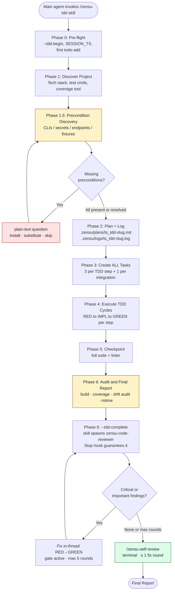
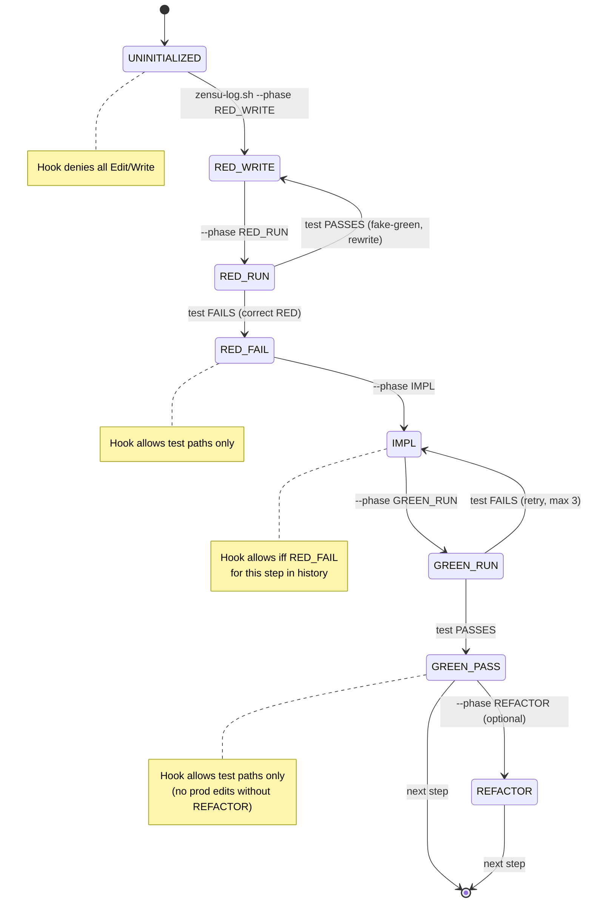
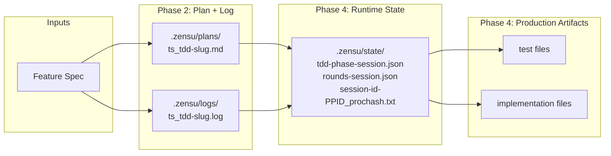
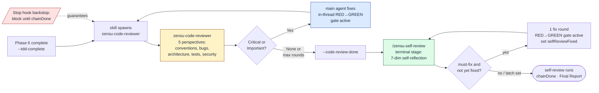

# TDD Workflow (`/zensu-tdd`)

End-to-end reference for the Zensu main-thread TDD workflow that drives strict Red/Green TDD with a PreToolUse phase gate.

> **0.4.0 migration.** TDD execution moved from the `zensu-tdd-manager` *subagent* into the **main agent** (the subagent lost too much implementation context). The workflow now lives in the `skills/tdd/SKILL.md` skill. `zensu-code-reviewer` is the only remaining subagent. Sections 7–8 below describe the eval harness, whose port to the main-thread model is tracked as a follow-up.

---

## 1. Overview

**What it is.** A main-thread skill (`/zensu-tdd`) that takes a feature specification and produces working, tested code through a strict TDD discipline. The main agent runs it directly. It writes a plan, declares phase transitions (RED → IMPL → GREEN → REFACTOR), and is enforced by a PreToolUse hook that blocks edits which violate the cycle.

**When to invoke.**

```
Use the Skill tool with skill='zensu-tdd' and the feature spec as input
```

The skill is also auto-invoked by the `ExitPlanMode` PostToolUse hook when the user approves a plan that adds executable code, and by `/zensu-implement` Step 3.

**Inputs.**

- A feature specification (free-form text, or a path to `evals/.../prompts/*.md` in eval context).
- Project context — the agent discovers tech stack, test commands, coverage tooling automatically.

**Outputs.**

| Artifact | Path | Purpose |
|----------|------|---------|
| Plan | `.zensu/plans/{ts}_tdd-{slug}.md` | Design decisions, step table, preconditions, audit checklist |
| Log | `${CLAUDE_PROJECT_DIR:-.}/.zensu/logs/{ts}_tdd-{slug}.log` | Append-only execution trace, phase markers, attempts, audit results |
| State | `.zensu/state/tdd-phase-{session}.json` | Runtime FSM state (per session, ephemeral) |
| Source | test + implementation files | The actual code |
| Audit | included in log + final report | Build, coverage, mtime discipline, precondition drift |

The plan and log are durable repo artifacts. They are auto-staged and committed (see [CLAUDE.md](../CLAUDE.md) repo conventions).

---

## 2. Two-Level Mental Model

Two distinct phase concepts share the word "phase". Keep them separate.

**Workflow Phases (0-6)** — the agent's overall journey for a single task. Linear, one-shot per invocation.

**TDD-FSM phases** — per-step state that the PreToolUse hook reads from the state file. Cyclical, repeated for each step inside Phase 4.

Each step inside Workflow Phase 4 cycles the TDD-FSM through `RED_WRITE → RED_RUN → RED_FAIL → IMPL → GREEN_RUN → GREEN_PASS` (and optionally `REFACTOR`). When all steps complete, the agent advances to Workflow Phase 5.

---

## 3. High-Level Workflow



**Phases at a glance:**

| Phase | Goal | Key outputs |
|-------|------|-------------|
| 0. Pre-flight | Capture `SESSION_TS` + `SESSION_EPOCH`, create first task | session timestamps |
| 1. Discover Project | Read CLAUDE.md hierarchy, detect tech stack, test runners, coverage tool + threshold | tech-stack context |
| 1.5. Precondition Discovery | Enumerate every external CLI/secret/endpoint/fixture named by the spec, verify presence, escalate misses | Preconditions table in plan |
| 2. Plan + Log | Write plan markdown + initialize log file | plan + log on disk |
| 3. Create ALL Tasks | 3 tasks per TDD step (test/impl/verify) + 1 per integration step | TaskList populated |
| 4. Execute TDD Cycles | Per step: RED → IMPL → GREEN (+ REFACTOR if applicable) | source code + tests |
| 5. Checkpoint | Run full test suite + linter, batch-update plan statuses | checkpoint log entry |
| 6. Audit & Final Report | Build verification, coverage, mtime discipline, precondition drift audit, summary | audit log + final report |

See [agents/tdd-manager.md](../agents/tdd-manager.md) for the canonical phase definitions.

---

## 4. Per-Step TDD-FSM

Inside Phase 4, each step cycles through a small state machine. The PreToolUse hook ([hooks/pre-edit-tdd-reminder.sh](../hooks/pre-edit-tdd-reminder.sh)) reads the current phase from the state file and allows or denies the write tool tool calls based on it.



Phase transitions are recorded by invoking the log helper:

```bash
bash $CLAUDE_PLUGIN_ROOT/hooks/lib/zensu-log.sh --phase {PHASE} --step {step_id} [--reason "..."]
```

The helper writes both a log line and updates the state file under a `flock` (or `mkdir`-based fallback) mutex.

---

## 5. Hook Gate Behavior

The preToolUse hook fires on the Kiro `write` tool (aliases `fs_write`, `fsWrite`; legacy Claude `Edit|Write|MultiEdit` and Codex `apply_patch` payloads still parse). It allows or denies based on `(phase, file path type)`.

| Phase | Production file edit | Test file edit |
|-------|---------------------|----------------|
| `UNINITIALIZED` | DENY | DENY |
| `RED_WRITE` | ALLOW | ALLOW |
| `RED_RUN` | (transient, no edits expected) | (transient) |
| `RED_FAIL` | DENY | ALLOW |
| `IMPL` | ALLOW iff this step has `RED_FAIL` in history | ALLOW |
| `GREEN_RUN` | (transient) | (transient) |
| `GREEN_PASS` | DENY | ALLOW |
| `REFACTOR` | ALLOW | ALLOW |

**Test-path detection** ([hooks/lib/zensu-tdd-phase.sh::tdd_is_test_path](../hooks/lib/zensu-tdd-phase.sh)):

1. Path prefix match: `**/test/**`, `**/tests/**`, `**/__tests__/**`, `**/spec/**`, `**/specs/**`, plus top-level variants (case-insensitive)
2. Basename match: `_test.*`, `*_test.*`, `.test.*`, `.tests.*`, `.spec.*`, `.specs.*`, `_spec.*`, `_specs.*`
3. Hard-link rejection: files with link count > 1 fail closed (prevents `ln target.test.ts innocent.ts` bypass)
4. Symlink rejection: `[ -L "$path" ]` → not a test
5. Inline-header sniff (last resort): read first 20 lines, strip BOM, match `^(func Test|describe\(|it\(|test\(|@Test|def test_|#\[test\]|#\[cfg\(test\)\])`. Comment-prefix lines like `// describe(` are NOT matched (anchored at line start, no leading comment chars).

**Hook scope.** The gate is active **only** while the per-session chain-state `active` flag is set — written by `zensu-log.sh --tdd-begin` in Phase 0 of the `/zensu-tdd` skill. Before `--tdd-begin`, and for any session with no active TDD chain-state (other main-thread work, other subagents, plain CLI), the hook exits 0 silently and lets the action through. This replaces the pre-0.4.0 `CLAUDE_AGENT_TYPE=zensu-tdd-manager` scoping that only worked while TDD ran in a subagent. It remains a deliberate trust-boundary: in-moment reminders for the main-thread TDD session, not bulletproofing against malicious actors.

---

## 6. Environment Variables

| Variable | Where set | Effect |
|----------|-----------|--------|
| `CLAUDE_AGENT_TYPE` | Claude-code harness sets it on subagent spawn (e.g. `zensu-code-reviewer`). | Since 0.4.0 it no longer gates the TDD phase-gate/witness — activation moved to the chain-state `active` flag. Retained for other introspection and the eval harness. |
| `ZENSU_TDD_GATE` | User sets in shell | Set to `off` to bypass the phase-gate entirely for legitimate non-TDD edits (docs, config, one-offs). |
| `ZENSU_CHAIN` | User sets in shell | Set to `off` to disable the `Stop`-hook review-chain backstop ([hooks/stop-chain-enforcer.sh](../hooks/stop-chain-enforcer.sh)) so the main agent may end its turn without completing the review chain. |
| `ZENSU_HOOK_LOG` | Eval wrapper sets per isolated test dir | Opt-in mirror of denial reasons. Hook writes 4 lines (`TDD-Phase-Gate`, `Current phase:`, `Expected:`, `permissionDecision=deny`) on denial. Empty file in production. |
| `TDD_STATE_DIR` | Caller may override | State file location. Default `${CLAUDE_PROJECT_DIR}/.zensu/state`. |
| `TDD_DISABLE_FLOCK` | Test fixture sets | Test-only. Forces the `mkdir`-fallback mutex path (exercises stale-lock recovery on Linux/CI where `flock` is present). |
| `CLAUDE_PROJECT_DIR` | Claude-code harness | Root for relative state paths. |

---

## 7. Files Produced Per Task



The plan + log files form a durable audit pair. State files are ephemeral per session. All three live under `.zensu/` and are auto-staged for commit per repo convention.

Per-session state files (`tdd-phase-<session>.json`, `rounds-<session>.json`, `session-id-<PPID>_<prochash>.txt`) are all project-local under `${CLAUDE_PROJECT_DIR:-.}/.zensu/state/` by default since 0.3.23 (0.3.20 attempted this but the `CLAUDE_PLUGIN_DATA` fallback was unreachable inside claude-code — fixed in 0.3.23 by introducing a new opt-in `CLAUDE_PLUGIN_DATA_OVERRIDE` env var and ignoring claude-code's auto-set `CLAUDE_PLUGIN_DATA`). Power-users can still relocate the rounds counter via `CLAUDE_PLUGIN_DATA_OVERRIDE` (e.g. `$HOME/.zensu/state` to centralize across worktrees). The SessionStart `session-id-*.txt` cache enables 3-tier session-id resolution (stdin → cache → `fallback_<key>` deterministic fallback) so a missing `session_id` payload no longer collides on a literal `unknown` bucket.

---

## 8. Discipline Patches — User-Visible Behaviors

These are the guardrails that protect users from common TDD failure modes. Each is pinned by structure tests in [tests/structure/](../tests/structure/).

| Patch | What it does | User benefit |
|-------|--------------|--------------|
| **1. Rationalization Counters** | Three patterns recognized as agent self-deception: "I'll just write a quick replacement", "I'll commit a placeholder fixture", "user said no questions so I'll guess". Each is labeled a LIE in the agent prompt. | Agent doesn't talk itself into corner-cutting. |
| **2. Hard Ban on substitution** | Forbids substituting a missing required dependency with a hand-rolled equivalent without explicit user approval. | No silent `KNOWN-ISSUES.md` workarounds. No fake adapters. |
| **3. Phase 1.5 Precondition Discovery** | Enumerates every external CLI/secret/endpoint/fixture named in the spec, verifies presence, and on missing → plain-text question (install / substitute / skip). Overrides any prior "no questions" instruction. | Agent stops and asks BEFORE damaging your workspace with placeholder values. |
| **4. Preconditions table in plan** | Plan template includes `## Preconditions` section listing every dependency + verification + user decision. | Auditable record of what was assumed present. |
| **5. Per-step precondition gate** | If a step's IMPL plan references a precondition marked `skip`, the step gets `[!]` status and is bypassed. No partial test, no placeholder. | Skipped dependencies don't leak into half-broken implementations. |
| **6. Phase 6 Precondition Drift Audit** | Greps the log for the contracted tool name versus the user-named substitute. Flags `PRECONDITION DRIFT — {tool}: decision={d}, actual={observed}` when reality diverges from the plan. | Catches silent substitution after the fact. |
| **7. Claude-code CLI promptfoo provider** | Wrapper [scripts/claude-promptfoo-wrapper.sh](../scripts/claude-promptfoo-wrapper.sh) invokes local `claude` as promptfoo `exec:` provider. APFS `cp -cR` per-test isolation. | Eval suite runs without an API key, isolated per test, deterministic. |
| **8. Hook event mirror** | Opt-in via `ZENSU_HOOK_LOG`. Hook writes denial reason lines into the log when the gate fires. | Eval assertions can verify gate behavior without reading hook stderr. |
| **9. FSM state enrichment** | Wrapper appends `===== fsm state =====` block (jq-scraped from state file) to its output. | Eval assertions see the phase history. |
| **B. CLAUDE_AGENT_TYPE export** | Wrapper explicitly `export`s the env var before exec'ing claude. | Hook fires in subagent context where the harness doesn't propagate it natively. |

---

## 9. Auto-Review Chain

At Phase 6 the `/zensu-tdd` skill marks `--tdd-complete` and spawns `zensu-code-reviewer` itself. The `Stop` hook ([hooks/stop-chain-enforcer.sh](../hooks/stop-chain-enforcer.sh), registered on the `Stop` matcher in [hooks/hooks.json](../hooks/hooks.json)) guarantees the chain even if that spawn is skipped: it blocks the main agent from ending its turn while `implComplete && !chainDone`. Reviewer findings are routed back into the main thread by [hooks/post-review-tdd-delegate.sh](../hooks/post-review-tdd-delegate.sh) to be fixed in-thread under the still-active phase-gate, then the reviewer is re-spawned — looping until PASS or max rounds, after which the terminal `/zensu-self-review` stage runs (see below).



Reviewer returns findings in three tiers:

- **Critical**: blocks ship. Auto-fix attempted.
- **Important**: should land before merge. Auto-fix attempted.
- **Suggestions**: nice-to-have. NOT auto-fixed.

Auto-fix loop runs up to 5 rounds (configurable via `autoFixMaxRounds` in plugin settings). On the 5th round, the harness emits "max rounds reached, manual fix required" and hands off to the terminal self-review stage (below) instead of stopping — preventing infinite loops on intractable findings.

**Terminal self-review stage (0.5.0+).** When `hooks.selfReview` is enabled (default), the code-reviewer chain does NOT close at convergence. On PASS, suggestions-only, or max-rounds, [hooks/post-review-tdd-delegate.sh](../hooks/post-review-tdd-delegate.sh) marks `--code-review-done` and hands off to the `/zensu-self-review` skill ([skills/self-review/SKILL.md](../skills/self-review/SKILL.md)) — a main-thread terminal stage ported from `/reflect`. It re-reads the session's own changes across seven dimensions (architecture, consistency, edge-cases, test coverage, security, simplification, conventions), takes at most ONE fix round under the still-active phase-gate if a must-fix surfaces (latched by `selfReviewFixed`; it never re-spawns the code-reviewer), then owns the chain terminus: it runs `--chain-done` and renders the final report including a `## Self-Review Summary`. The `Stop` hook ([hooks/stop-chain-enforcer.sh](../hooks/stop-chain-enforcer.sh)) routes to self-review while `codeReviewDone && !chainDone`. Set `hooks.selfReview=false` to restore the pre-0.5.0 behavior where code-reviewer convergence closes the chain directly.

**Chain-end combined summary.** At every chain-end branch — PASS / zero findings, suggestions-only stop, and max-rounds convergence — `hooks/post-review-tdd-delegate.sh` appends a `CHAIN-END SUMMARY` directive to its `additionalContext` output. The main agent then renders a narrative summary block in this order: `## Problem` (the feature/bug/need this session addressed), `## What I built` (numbered deliverables with status + PR links, carrying the audit facts — feature title, files modified, tests created, build status, mtime audit verdict, coverage status, plan + log paths), `## How I built it` (the TDD discipline followed, the final reviewer verdict with findings count by severity and files reviewed, and the per-round auto-fix trace of EVERY review round 1..N — each round's in-thread fixes plus the clean verification round(s) marked `PASS — 0 findings, nothing to fix`, so the reader sees the chain converged with all findings addressed; skipped only when no review round ran), `## Open` (deferred suggestions / max-rounds findings requiring manual fix / next step), and `## TL;DR` (exactly one sentence, last). This replaces the prior terse-stop behavior so the user retains visibility into the full chain. When `hooks.selfReview` is enabled (default), the terminal `/zensu-self-review` stage renders this summary and inserts a `## Self-Review Summary` section before `## Open`. Controlled by `hooks.combinedSummary` in `~/.zensu/config.json` (default `true`; set `false` to restore terse stop). Contrast `autoFixIncludeSuggestions` which defaults to disabled — `combinedSummary` defaults the other way.

---

## 10. Four-Channel Logging Contract

Every TDD-Manager task writes to four channels:

| Channel | What | Lifetime | Format |
|---------|------|----------|--------|
| **Plan** | Design decisions, step table, Preconditions, audit checklist | Durable (git-committed) | Markdown |
| **Log** | Execution trace: phase markers (`RED_WRITE`, `RED_FAIL`, `IMPL`, `GREEN_PASS`, `REFACTOR`), attempt counts, audit results | Durable (git-committed) | Append-only timestamped text |
| **State** | Current FSM phase per session, history array | Ephemeral per session | JSON |
| **Witness** | Independent record of every shell tool invocation (cmd, exit code, stdout tail, interrupted flag) | Ephemeral per session — **local only, gitignored, never committed** (consumed solely by the in-session Phase 6 cross-check); under promptfoo it lives in the per-test isolated dir | Append-only timestamped text, JSON-escaped fields |

The agent appends to the log via:

```bash
printf '%s%s\n' "$(bash $CLAUDE_PLUGIN_ROOT/hooks/lib/zensu-log.sh timestamp $SESSION_EPOCH)" "<message>" >> "${CLAUDE_PROJECT_DIR:-.}/.zensu/logs/{ts}_tdd-{slug}.log"
```

The helper resolves the user's configured `logging.timestampStyle` (`wall`, `relative`, or `none`) so the log format is consistent across runs. Do not inline `$(date +%H:%M:%S)` — that bypasses the user's preference.

Phase transitions are atomic:

```bash
bash $CLAUDE_PLUGIN_ROOT/hooks/lib/zensu-log.sh --phase {PHASE} --step {step_id} [--reason "{reason}"]
```

This writes a log line AND updates the state file in a single critical section (under `flock` or mkdir-mutex), preventing concurrent-write races between parallel agents.

### Witness channel — anti-hallucination evidence

The witness log at `${CLAUDE_PROJECT_DIR:-.}/.zensu/logs/witness-<session>.log` is written automatically by the `hooks/post-bash-witness.sh` PostToolUse hook on every shell tool call. The hook records lines only while the session's chain-state `active` flag is set (set by `zensu-log.sh --tdd-begin` in Phase 0; no other actor records witness lines) and can be disabled with `ZENSU_TEST_WITNESS=off`. The witness log is **gitignored and never committed** — it is ephemeral, single-session evidence; only the narrative `.log` and the plan are durable git-tracked artifacts.

Each line has the form:

```
[HH:MM:SS] BASH cmd="<JSON-escaped command>" exit=<rc|?> tail="<JSON-escaped last 200 chars of stdout>" interrupted=<true|false>
```

In practice `exit=` is almost always `?`: Claude Code's Bash `tool_response` carries no `exit_code` field (only `stdout`/`stderr`/`interrupted`/`isImage`), so the witness corroborates a run by `cmd=` + the stdout `tail=`, never by exit code. `interrupted=true` flags a killed or timed-out run. The tail is **stdout only** — a runner that prints its failure summary to stderr yields an empty `tail=`, so result-corroboration cannot fire there and the `cmd=` match remains the gate.

The witness log is the source of truth for Phase 5/6 cross-checks. The agent prompt mandates that every test/lint/build run logged in Phase 5 (`CHECKPOINT — cmd="X" exit=N result="..."`) and Phase 6 (`AUDIT — cmd="X" exit=N result="..."`) use the literal command string sent to the shell tool. Phase 6 step 1 then runs `grep -F -q 'cmd="X"' witness.log` for each claim; an unmatched claim becomes `EVIDENCE GAP — cmd="X" claimed but not in witness log` and marks Phase 6 NOT complete.

Non-Bash test invocations (rare; e.g. an MCP test runner) use the `via=tool_name claim="..."` escape clause instead of `cmd="..."`. Audit treats `via=` as a known-limit (no cross-check possible) and surfaces it prominently in the final report.

---

## See Also

- [agents/tdd-manager.md](../agents/tdd-manager.md) — canonical agent prompt
- [hooks/pre-edit-tdd-reminder.sh](../hooks/pre-edit-tdd-reminder.sh) — gate enforcement
- [hooks/lib/zensu-tdd-phase.sh](../hooks/lib/zensu-tdd-phase.sh) — state file I/O
- [hooks/lib/zensu-log.sh](../hooks/lib/zensu-log.sh) — log + phase helper CLI
- [hooks/hooks.json](../hooks/hooks.json) — hook registrations
- [scripts/claude-promptfoo-wrapper.sh](../scripts/claude-promptfoo-wrapper.sh) — eval provider
- [evals/tdd-manager-pretool/](../evals/tdd-manager-pretool/) — 13 promptfoo scenarios verifying the discipline
- [tests/structure/](../tests/structure/) — 127 structure tests pinning the contract
- [CLAUDE.md](../CLAUDE.md) — repo conventions (English-only, version bumps, PR workflow)
- [CHANGELOG.md](../CHANGELOG.md) — release history
